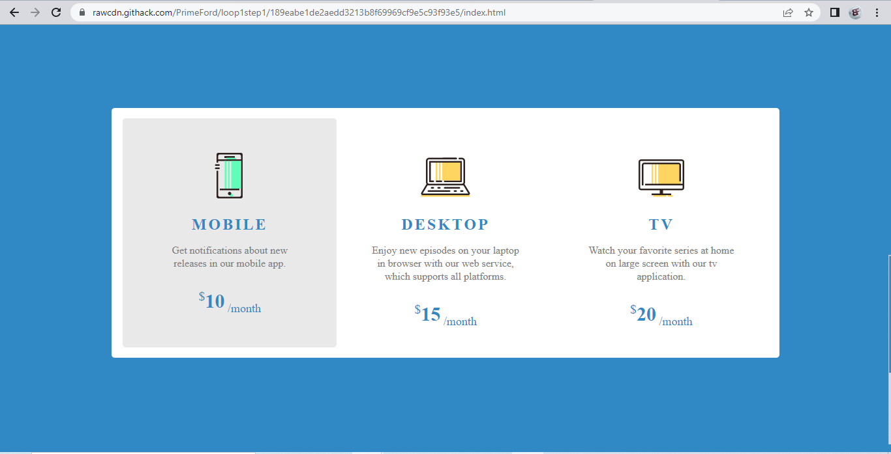

# loop1step1
*An implementation of Mobile subscription an screen view with HTML/CSS*

## Getting Started
Clone or download this repository and run with a local server of open `index.html` with your favorite browser

## Prequisite
- Your browser version must be recent for a better experience

## Features
- Mobile Subscription
- Laptop web Services
- TV view

## Tech/framework used
- HTML
- CSS

## Demo
[Preview Here](https://rawcdn.githack.com/PrimeFord/loop1step1/189eabe1de2aedd3213b8f69969cf9e5c93f93e5/index.html)

## Contact
If you want to contact me you can reach me at
-wolabash@gmail.com
-https://github.com/PrimeFord

## Addtional Info
- This is one of the series of project for the @Codevillage Programming Lessons.
- This is not meant for production. It's for learning purpose only